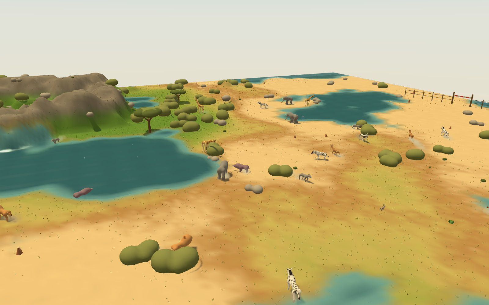
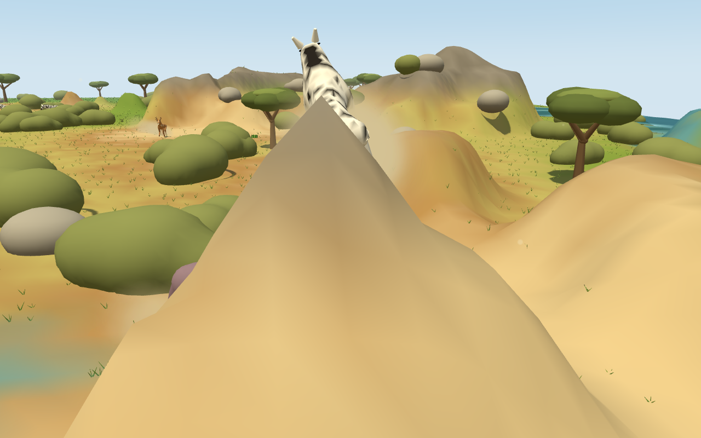
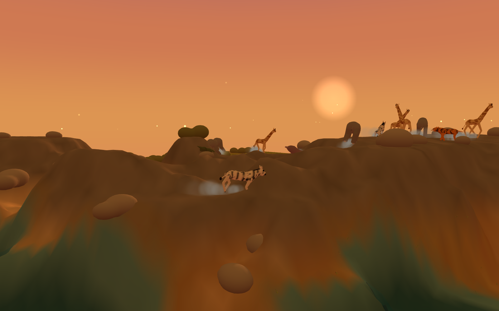

# Safari Simulator 3D

A living savanna ecosystem — stock a reserve, keep it in balance through drought,
nightfall and the hunt — rendered as real terrain with a camera you can walk around it.
Fork of [Safari Simulator](https://github.com/jackpepper-vibe/safari-simulator), same
reserve, real depth.

No build step, no dependencies, no network. Open `index.html`.



## What changed from the 2D game

Nothing about how it plays. The simulation — tile world, animal behaviour, ecology,
pathing, the ranger and his darts, the relocation chain, drought, fire, poachers, and
the ten-day warden's tenure with its stocking allowance — is carried over intact. What
was replaced is everything below the line marked `3D PRESENTATION LAYER` in
`index.html`, which only ever reads simulation state and never writes to it.

- **The ground is the elevation field the 2D game already had.** It used that field to
  decide how to *shade* its terraced benches; here the same field drives a 67,000-vertex
  mesh, so the escarpments the herds path around are escarpments you can see over.
  Waterholes are basins carved into it with a surface laid on top, rather than paint.

- **The animals are the rigs the 2D game already had.** `IsoSpecies` describes each
  species as anatomy in three dimensions — `fx` forward, `fy` left, `fz` up — because
  the isometric build projected it by hand. That data now builds a **skinned mesh**:
  one merged buffer, colour baked per vertex, bound to a skeleton. A zebra is one draw
  call, and its stripes are a function of position on the torso rather than a texture.

- **A body is one surface, not a pile of parts.** Barrel, shoulder, haunch, neck, skull
  and muzzle go into a signed distance field, are smooth-blended into each other, and
  are polygonised once at build time with surface nets. Assembled from intersecting
  ellipsoids — which is how this started — a hippo read as four visible lumps with a
  head balanced on them, and tessellation cannot fix that because the creases are real
  geometry. Skin weights come from the same field, so a vertex on the throat is shared
  between body and neck and the neck still bends. Bushes and boulders get the same
  treatment.

- **Giraffes and elephants browse.** The acacias are a food supply rather than scenery,
  so the scatter moved out of the renderer and into the world. A crown carries foliage
  that depletes as it is browsed and grows back over about two in-game days; a browser
  reaches up into it rather than putting its head down, and the crown visibly thins as
  it goes. That gives the reserve a second kind of food with a completely different
  shape to grass — a few rich points instead of an even field — so browsers gather,
  strip a stand and move on, and the giraffes are reliably somewhere worth watching.

- **The gait is the same gait.** Two-bone IK, a straight backward sweep in contact and a
  forward arc in the air, advanced by distance travelled so hooves never skate. The 2D
  version solved for a joint position to draw; this one emits bone rotations. Giraffes
  still pace, rabbits still hop, crocodiles still sprawl.



- **Grass answers to the herds.** Forty thousand instanced tufts in one draw call, whose
  vertex shader samples the same overlay texture the ground does — so a grazed-down tile
  is visibly cropped and a burnt one is bare, with nothing rebuilt when a zebra takes a
  mouthful.

- **One light, following whichever body is up.** The 2D build derived shadow direction
  and length from the sun by day and the moon by night, from a single rule; that rule now
  places a real directional light with a shadow camera that tightens as you zoom in. Sky
  gradient, haze, fog, exposure and star opacity all still come from the one sampled
  `LightingState`, so nothing can disagree about the time of day.



## Commanding it

| Input | Action |
| --- | --- |
| Left-drag | pan the ground |
| Right-drag | orbit — yaw and pitch |
| Wheel | zoom toward the pointer |
| WASD / arrows | pan |
| `Q` / `E` | rotate by a step |
| Click a species, then the ground | place it |
| Click the ranger, then an animal | sedate it |
| `F` | follow the animal under the pointer |
| `G` | scatter forage · `R` jump to the ranger |
| `Space` pause · `1`–`5` speed · `M` sound · `Esc` end the run |

**The camera is a free orbit**, which is the main departure from Iron Dominion 3D's
fixed rake. That fork locked yaw because marquee select, a placement ghost and edge
scroll all stay predictable only when the world faces one way. None of those exist here
— placement is a single click and there is no unit selection — so rotating around a herd
is pure gain, and a giraffe against the sky is worth the freedom.

Two things are deliberately still flat. **Condition bars** are drawn on a 2D canvas over
the render, because their whole job is to be readable at a glance across ninety animals
and foreshortening them would only make that harder. The **dock portraits** are the
original 2D creature art, which is still the best thing to put in a 66-pixel chip.

## Development

```
node scripts/shot.mjs            the standard screenshot set
node scripts/shot.mjs zebra 17.4 one shot, at a given hour
node scripts/smoke.mjs           the functional test
```

`window.SS3D` is the test hook — drop into a stocked run, park the camera, jump the
clock, spawn, and step the simulation without waiting on frames:

```
node C:/Claude/Tools/shot/shot.mjs ./index.html --viewport 1280x800 --wait 3500 \
  --eval "SS3D.bare(); SS3D.begin({animals:36, hour:17.4}); SS3D.step(120); \
          SS3D.find('giraffe', 6); SS3D.draw()" \
  --out shots/giraffe.png
```

`scripts/smoke.mjs` is the one that matters after touching input. The fork rewrote every
path between the pointer and the simulation — screen-to-world is a raycast against the
heightfield, the minimap outline is four picking rays, animals are picked against the
ground — and none of that shows up in a screenshot.

Setup, if ever missing: `npm i -D playwright && npx playwright install chromium`.

## Credits

Built with Claude Code. Three.js is vendored at `vendor/three.min.js` rather than pulled
from a CDN, because the screenshot harness loads the page over `file://` with no network.
